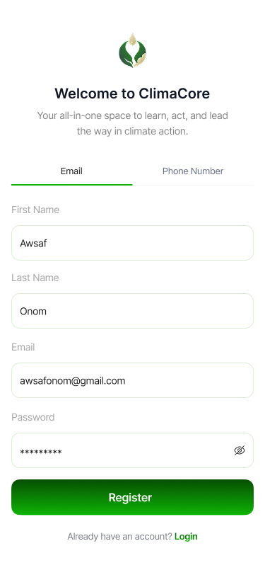
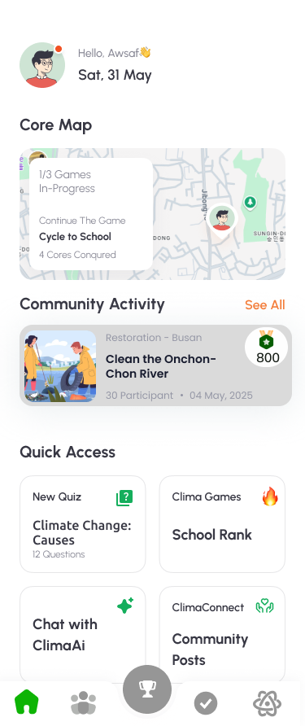
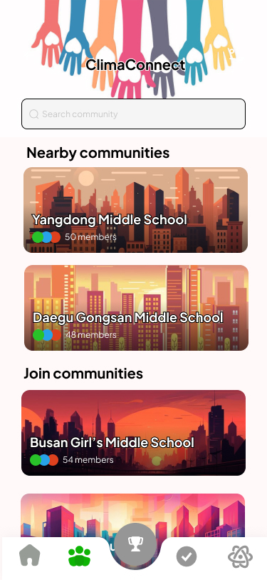
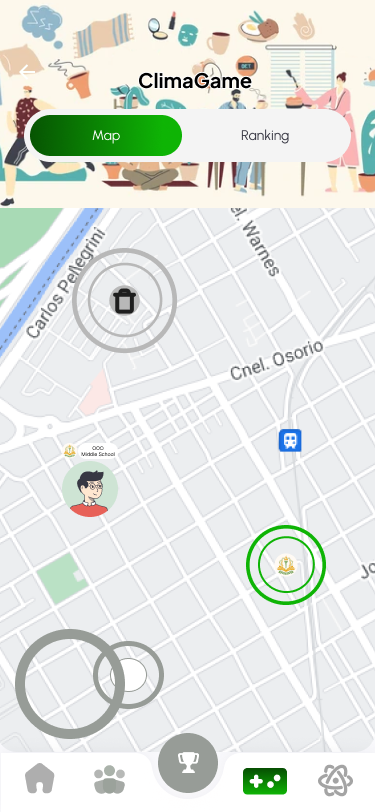
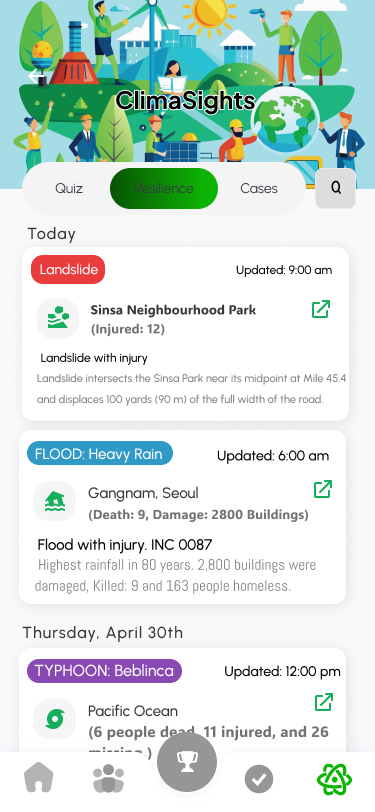
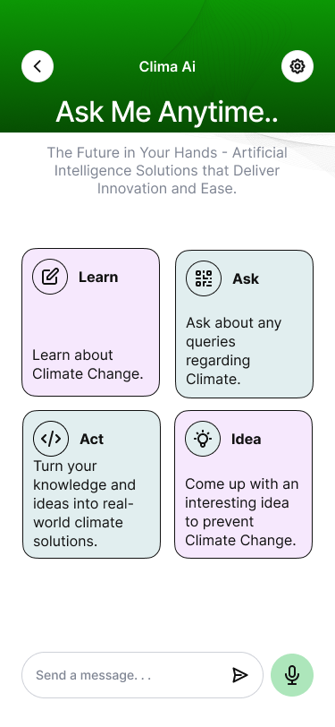
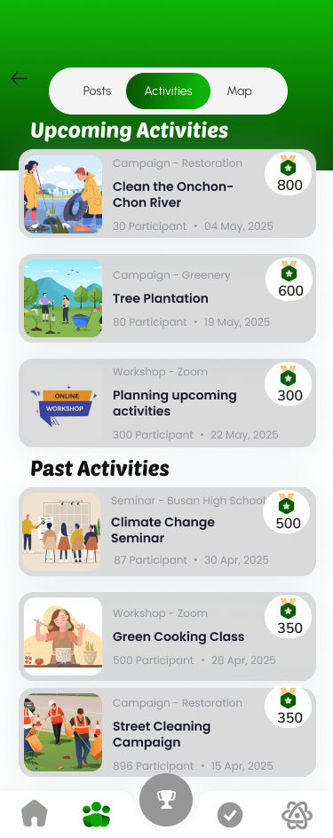
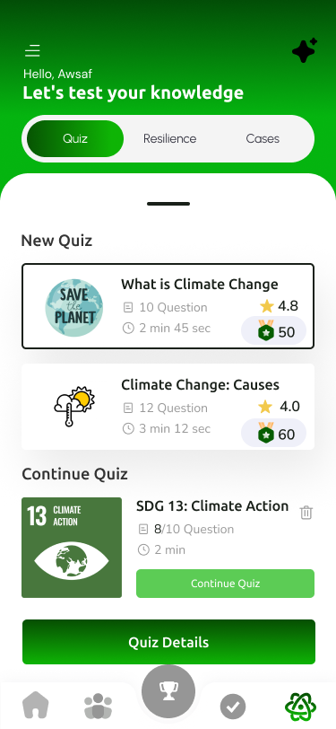
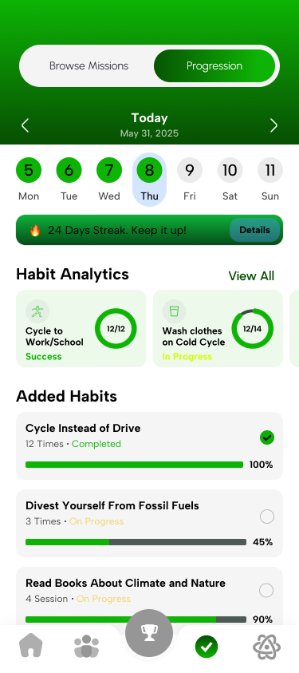
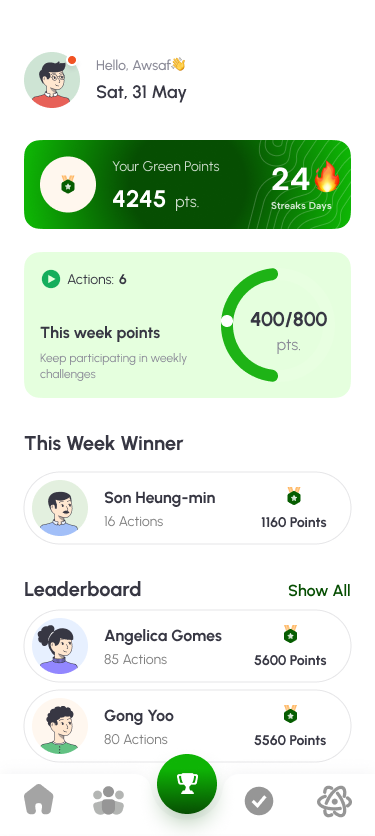

# ClimaCore

**A student-centered climate action app for schools — built for SDG 13.**

**🏆 1st place, 15th e-ICON World Contest 2025 — 161 projects, 37 countries. Award received from the Minister of Education, South Korea.**

🎬 **50-second promo vid:** 

https://github.com/user-attachments/assets/63f55235-0119-4713-b310-eba1ea6eba87


| | |
|---|---|
| 📱 **[Download APK](https://drive.google.com/file/d/1qbVFBRkjFq9oR8gZCL2ga_iniPJqNUko/view)** | 🎥 **[Full demo video](https://drive.google.com/drive/u/0/folders/1YPLztBb1bGR6G6U7fjy9U8P68T_kPTk8)** |

---

## The Problem

Korean youth show strong climate concern — **90.8% of surveyed students** expressed worry about climate change — but **participation in social climate action stays low**. Common blockers: lack of time, inconvenience, low engagement, and information scattered across apps and news sites. ClimaCore tries to close that gap by putting community action, gamified missions, and climate learning in one place students already use: their phones.

---

## The Three Modules

### 🤝 ClimaConnect — Community

A school-based social layer that turns individual effort into collective momentum.

Students browse and join their school's community, then share climate actions in a feed where peers can like, comment, and be inspired. Community leaders organise real-world activities — river cleanups, tree plantations, workshops, seminars — with dates, locations, and point values attached. Students join with one tap, and leaders confirm attendance afterward to release green points.

The design goal was replacing "searching" with "joining." Research showed the effort of finding and organising climate action was greater than the effort of doing it, so ClimaConnect removes that friction entirely.

### 🎮 ClimaGame — Gamified Action

A GPS-driven, two-month team competition that puts climate action into physical space.

Ecores spawn at random real-world locations on the map. Students physically travel to them and unlock five climate missions each — turning off lights, unplugging devices, meatless meals, adjusting AC temperature — with each mission carrying a description, practical tips, and a point value designed to build the action into a lasting habit.

Multiple schools compete for the same ecore. Whoever completes the most missions captures it; ties break on who finished last. The winning team splits the combined points from all five missions, while other teams still keep what they individually earned.

Guardrails keep it fair: three missions per student per day, photo verification on every submission, and a cooldown after capture so ecores can't be immediately retaken. Points feed both personal profiles and a live school leaderboard.

### 🌍 ClimaSight — Awareness

A real-time hub that turns climate information into climate literacy.

**Quiz** — Topic-based quizzes on carbon footprint, climate causes, renewable energy, and SDG 13, with scoring, attempt history, and green points for correct answers.

**Resilience** — A live disaster feed pulling floods, landslides, typhoons, and wildfires, with location, casualties, and damage details, newest first.

**Cases** — Real accounts of people displaced or harmed by climate events, with name, disaster type, and outcome. It reframes climate change from a future concern into something already happening to specific people.

**ClimaAI** — An assistant with four modes: Learn, Ask, Act, and Idea. Students can explore a topic, ask a question, get concrete actions, or develop their own solutions.
---

## Screenshots

| | | |
|:---:|:---:|:---:|
|  |  |  |
| Registration & onboarding | Home dashboard | ClimaConnect school feed |
|  |  |  |
| ClimaGame — ecore map & missions | Disaster alerts & resilience news | ClimaAI chat assistant |

<details>
<summary>More screenshots</summary>

| | | |
|:---:|:---:|:---:|
|  |  |  |
| Community activity detail | Quizzes — learn & act | Personal habit tracking |
|  | | |
| Points & rewards | | |

</details>

---

## Tech Stack

Built with **Flutter / Dart** (SDK `^3.8.0-278.1.beta`, Flutter **3.27-era**). Targets **Android and web** — there is no `ios/` folder.

| Package | Used for |
|---|---|
| `firebase_core`, `firebase_auth`, `cloud_firestore` | Authentication and all app data |
| `supabase_flutter` | Image storage (profile pics, posts, mission proof) |
| `google_maps_flutter`, `geolocator`, `permission_handler` | ClimaGame map, user location, permissions |
| `http` | ClimaAI chat (Gemini) and climate news APIs |
| `flutter_dotenv` | API keys and secrets via `.env` |
| `google_fonts` | App typography (Questrial) |
| `flutter_svg`, `cached_network_image` | Icons, markers, remote profile images |
| `image_picker`, `image` | Photo capture and compression for uploads |
| `shared_preferences` | Settings (language, notifications) |
| `uuid` | Generated IDs for posts, comments, quiz attempts |
| `intl` | Date formatting in news and disaster UI |
| `url_launcher` | Opening external news and source links |
| `flutter_native_splash` | Launch splash screen |
| `cupertino_icons` | Material / Cupertino icon set |

Other dependencies in `pubspec.yaml` (`provider`, `geocoding`, `lottie`, `shimmer`, etc.) were added during development; not all are wired into the final prototype.

---

## Architecture

ClimaCore is a Flutter client talking to **Firebase** (auth + Firestore) and **Supabase** (image blobs). External APIs supply maps, AI chat, and news. State is mostly service-layer calls from screens; no separate backend server.

### Firestore layout

**Top-level collections**

| Collection | Purpose |
|---|---|
| `users` | Profiles, points, streaks, school membership |
| `schools` | School metadata and member counts |
| `quizzes` | Quiz content (questions embedded in docs; optional `questions` subcollection) |
| `ecores` | Map spawn points, missions, conquest state |
| `cases` | Climate impact stories |
| `verification_requests` | Photo-proof review for activities and missions |
| `quiz_progress` | Legacy in-progress quiz state (superseded by `quiz_attempts`) |
| `activities` | Legacy top-level seed data only — runtime uses subcollection below |

**Subcollections**

```
schools/{schoolId}/activities/{activityId}
schools/{schoolId}/posts/{postId}
  └── comments/{commentId}

users/{userId}/quiz_attempts/{attemptId}
users/{userId}/quiz_max_points/{quizId}
users/{userId}/dailyMissions/{YYYY-MM-DD}

quizzes/{quizId}/questions/{questionId}   ← fallback if not embedded
```

---

## Project Status

This repo is the **contest prototype as submitted** for the 15th e-ICON World Contest 2025. It was built mid-2025 on a **Flutter 3.27-era beta Dart SDK** and is **not deployed to app stores**. Dependencies have not been upgraded since submission; running it today may require pinning Flutter/Dart to a compatible 3.27-era toolchain. Treat it as an archived reference, not a maintained product.

---

## Getting Started

**Prerequisites:** Flutter SDK (~3.27 era), Android SDK (for mobile), and your own Firebase / Supabase / Google Cloud projects.

```bash
git clone https://github.com/YOUR_USERNAME/ClimaCore.git
cd ClimaCore
cp .env.example .env
```

Fill in `.env` with your keys (see `.env.example` for descriptions). **Important:** the Firebase Android API key must also be pasted into `android/app/google-services.json` as `current_key` — the committed file uses a placeholder.

```bash
flutter pub get
flutter run              # pick a device
flutter run -d chrome    # web
```

You need valid credentials for Firebase, Supabase, Google Maps, and Gemini before the full app will run. News API keys are optional (news fetching is disabled by default in code).

---

## Demo

🎥 **Full walkthrough (~2 minutes)** — *[video placeholder]*

A screen-by-screen tour of ClimaConnect, ClimaGame, and ClimaSight as demonstrated at the e-ICON final in Seoul.

---

## Team

| Name | Role | Country |
|---|---|---|
| **Awsaf Zaman Onom** | Team Lead, Planner & App Designer | Bangladesh |
| **Rayeen Ar Raad** | Lead Developer | Bangladesh |
| **Jungyoon Park** | Researcher | South Korea |
| **Seogwang Kim** | Researcher | South Korea |

Mentor: Md. Nahian Hossain, St. Joseph Higher Secondary School, Dhaka

---

## Recognition

- **1st place**, 15th e-ICON World Contest 2025 — Ministry of Education, South Korea / KEFA
- Selected from **161 projects across 37 countries**; advanced to the final 15 and presented live in Seoul
- Theme: **UN SDG 13 — Climate Action** (targets 13.1, 13.3, 13.5)

**Press & coverage**

- [Views Bangladesh — Bangladeshi duo tops International e-ICON Competition](https://viewsbangladesh.com/bangladeshi-duo-tops-international-eicon-competition-in-south-korea/)
- [Spike Story — e-ICON World Contest 2025 coverage](https://spikestory.com/bangladeshi-students-win-eicon-world-contest/)
- [Samakal (Bangla) — International stage success](https://samakal.com/bangladesh/article/312572/%E0%A6%86%E0%A6%A8%E0%A7%8D%E0%A6%A4%E0%A6%B0%E0%A7%8D%E0%A6%9C%E0%A6%BE%E0%A6%A4%E0%A6%BF%E0%A6%95-%E0%A6%AE%E0%A6%9E%E0%A7%8D%E0%A6%9A%E0%A7%87-%E0%A6%A6%E0%A7%87%E0%A6%B6%E0%A7%87%E0%A6%B0-%E0%A6%A6%E0%A7%81%E0%A6%87-%E0%A6%B6%E0%A6%BF%E0%A6%95%E0%A7%8D%E0%A6%B7%E0%A6%BE%E0%A6%B0%E0%A7%8D%E0%A6%A5%E0%A7%80%E0%A6%B0-%E0%A6%B8%E0%A6%BE%E0%A6%AB%E0%A6%B2%E0%A7%8D%E0%A6%AF)

---

## License

MIT — see [LICENSE](LICENSE).
